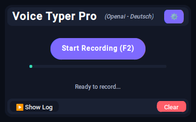

# VoiceTyper Pro

A graphical interface for voice-to-text transcription using Python. This application allows you to convert speech to text in real-time and automatically types the transcribed text at your cursor position.

Alternative to Mac Whisper, Voice Access, and other voice typing tools.



## 🔥 Features
- Real-time speech-to-text transcription
- Multiple speech recognition services (Deepgram and OpenAI)
- GPT-4o post-processing for improved transcript quality
- **NEW: LLM Optimization** for enhanced formatting and readability
- **NEW: Direct LLM Interaction** with "Hey LLM" commands
- Multiple language support with easy language selection
- Automatic text insertion at cursor position
- Keyboard shortcut support (F2)
- Modern customized UI with dark mode
- Transcription logging with expandable log view
- System tray integration for minimized operation
- Sound feedback for recording start/stop
- User-friendly settings dialog

## 🛠️ Requirements
- Python 3.7 or higher (3.9 recommended)
- Speech-to-text API key (Deepgram or OpenAI)
- Operating System: Windows, macOS, or Linux
- PortAudio (for PyAudio)

## 🚀 Setup Instructions

1. Install the required dependencies:

```bash
sudo apt-get install portaudio19-dev xdotool

cd C:\Projects\utils\ai\voice
git clone https://github.com/perrypixel/VoiceTyper-Pro.git
cd VoiceTyper-Pro

pyenv install 3.9
pyenv local 3.9

python3 -m venv venv

# Linux
source venv/bin/activate

# Windows
venv\Scripts\activate

pip install -r requirements.txt
```

2. Run the application:

```bash
python main.py
```
3. Add your API key in the settings dialog:
   - For Deepgram API, get one at https://deepgram.com
   - For OpenAI API, get one at https://platform.openai.com

4. Enjoy!


## 🎯 Usage
- Click the "Start Recording" button or press F2 to begin recording
- Click again or press F2 to stop recording
- The transcribed text will appear in the window and be typed at your cursor position
- Transcriptions are automatically logged and viewable in the expandable log section
- Customize settings by clicking the gear icon:
  - Switch between Deepgram and OpenAI services
  - Select your preferred language
  - Toggle GPT-4o post-processing (for OpenAI service)
  - **NEW: Enable LLM Optimization** for Markdown formatting and better structure
  - Test your API key directly from the settings dialog
- Minimize to system tray for unobtrusive operation

## 🧠 Advanced Features

### GPT-4o Post-Processing
When using the OpenAI service, you can enable GPT-4o post-processing to significantly improve the quality of transcriptions:
- Fixes grammatical errors
- Adds appropriate punctuation
- Corrects word misrecognitions
- Maintains the original meaning and intent
- Preserves technical terms and proper nouns
- Language-specific enhancements for German, French, Spanish and more

### NEW: LLM Optimization
This new feature enhances the text output specifically for Large Language Models:
- **Markdown Formatting**: Properly formatted headers, lists, and code blocks
- **Emphasis**: Important terms are highlighted with **bold** or UPPERCASE
- **Structure**: Improved paragraph structure and readability
- **Code Handling**: Properly formatted code blocks with syntax highlighting
- **Language-Specific Enhancements**: Optimized formatting based on language

### NEW: Direct LLM Interaction
You can now interact directly with the LLM by using "Hey LLM" commands:
- Start any sentence with "Hey LLM" to make a direct request
- The original text will be preserved and enhanced
- The LLM's response will be appended below a separator line
- Example: "Hey LLM, can you create a table with the information I just mentioned?"

### System Tray Integration
- Application can be minimized to system tray
- Continue recording and transcribing even when minimized
- Quick access to show/hide the application or quit

### Customizable UI
- Modern dark theme with AI gradient color scheme
- Expandable/collapsible log view
- Smooth animations for better user experience
- Sound feedback for recording status changes

## 🌐 Supported Services

### Deepgram
- High-quality speech recognition 
- Fast processing
- Multiple language support
- Uses the nova-2 model for improved accuracy

### OpenAI (Whisper)
- State-of-the-art accuracy
- Wide language support (15+ languages)
- Enhanced contextual understanding
- Optional GPT-4o post-processing
- **NEW: LLM Optimization** for better formatted output

## 🗣️ Supported Languages

The application supports many languages including:
- English
- German (Deutsch)
- French (Français)
- Spanish (Español)
- Italian (Italiano)
- Japanese (日本語)
- Chinese (中文)
- Russian (Русский)
- Portuguese (Português)
- Korean (한국어)
- Arabic (العربية)
- Dutch (Nederlands)
- Swedish (Svenska)
- Polish (Polski)

You can also use Auto-detect mode to let the service determine the language automatically.

## 💻 Technical Details

### Project Structure
The application is organized with a clean separation of concerns:
- `main.py`: The main application with UI and recording logic
- `speech_to_text.py`: Abstract interface for speech recognition services
- `deepgram_service.py`: Deepgram API implementation
- `openai_service.py`: OpenAI Whisper implementation with post-processing
- **NEW: `llm_prompts.py`**: Contains all prompts used for GPT-4o post-processing

### NEW: LLM Prompts
The application now uses structured prompts with:
- Base prompts for standard and LLM-optimized modes
- Language-specific additions for various languages
- Step-by-step processing with flag tracking
- Chain-of-thought approach for better reasoning
- Special handling for direct LLM interactions

## 🙏 Contributors
- https://github.com/perrypixel
- https://github.com/CyberT33N

